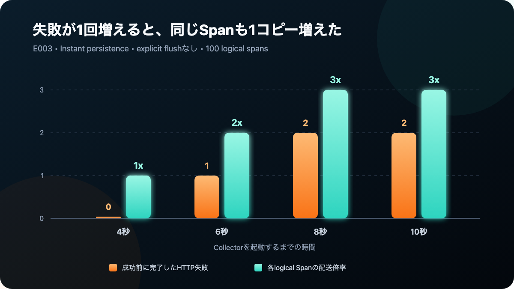
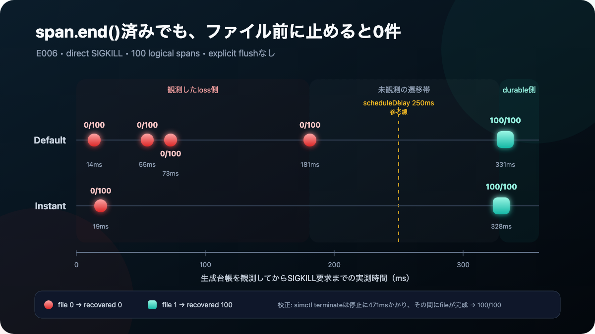
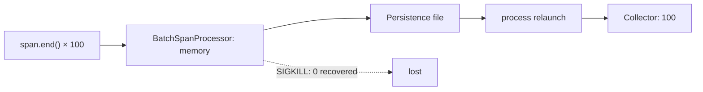
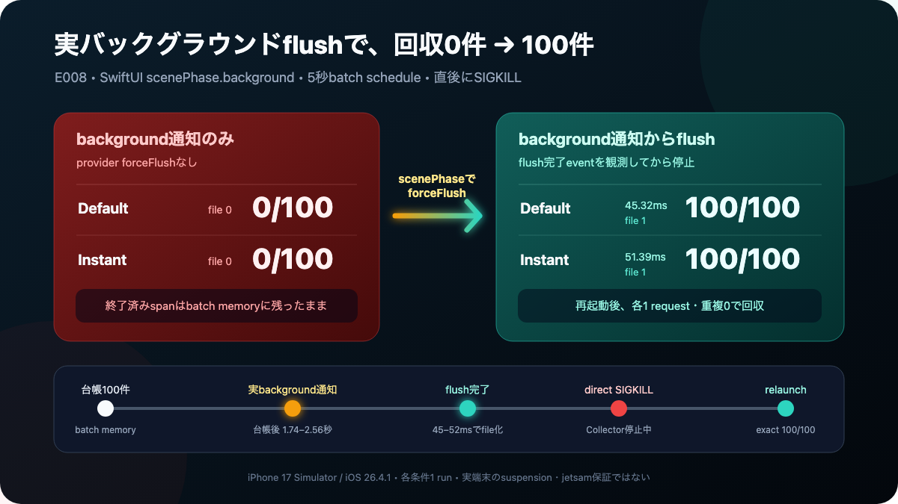
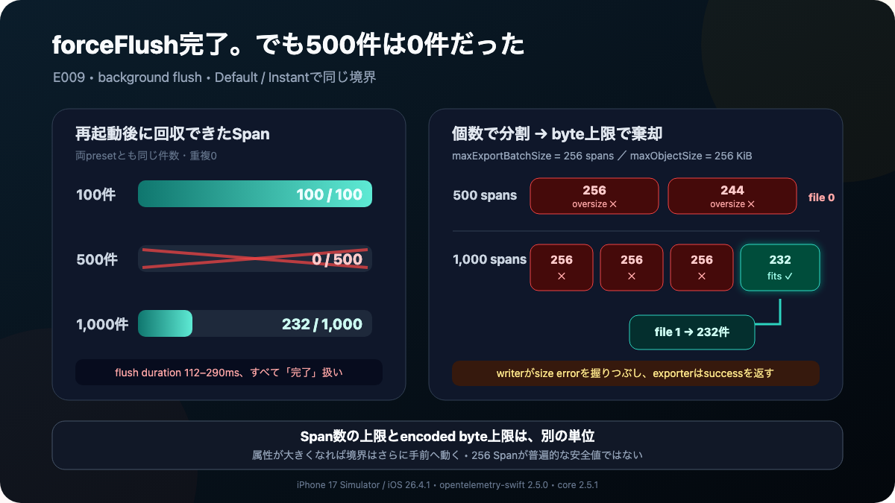
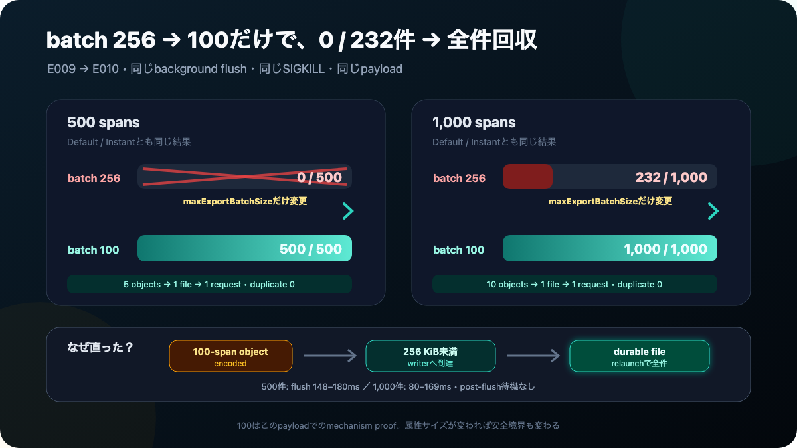
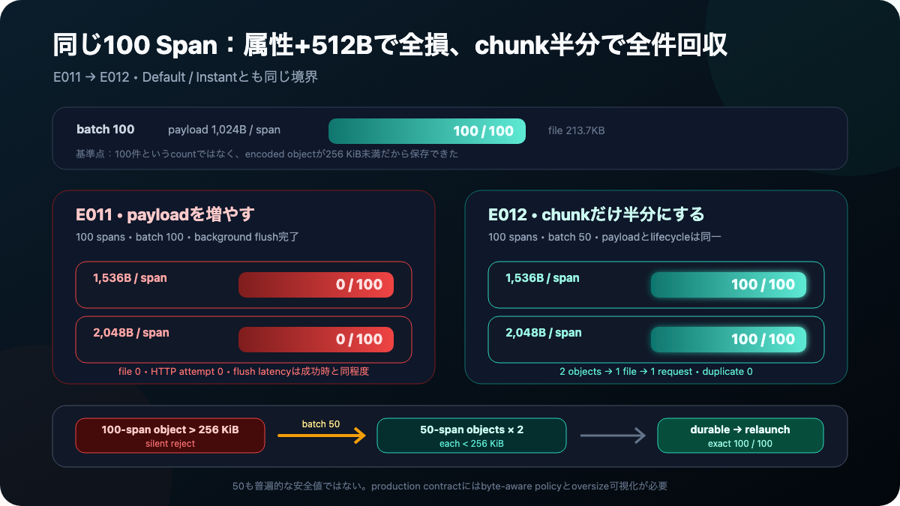
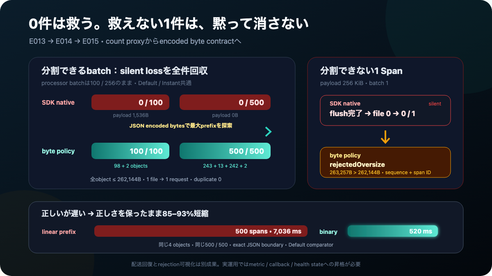
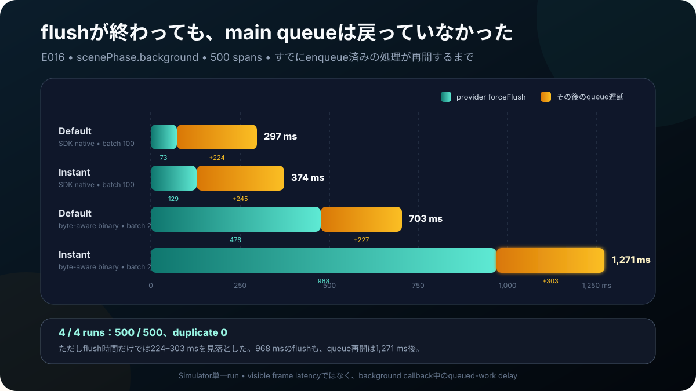

> 検証継続中のドラフトです。結論には必ずexperiment ID、生データ、
> reconciliation結果を対応させています。
>
> 全実験のコード・生データ・manifestはリポジトリで公開しています：
> [siu01/otel-ios-reliability-lab](https://github.com/siu01/otel-ios-reliability-lab)

## きっかけ

サーバーなら、送信に失敗したテレメトリをプロセスのメモリへしばらく
置いておける。しかしiOSアプリは圏外になり、バックグラウンドへ移り、
ユーザーに終了される。

では、OpenTelemetry SDKで`span.end()`を呼んだ100件のSpanは、実際には
何件バックエンドへ届くのだろうか。

今回の8秒障害では、永続化なしは0件、公式Defaultは100件、公式Instantは
200件届いた。さらに条件を分解すると、100件しか生成していないのに300件
届くrunまで再現した。

一方、100回の`span.end()`が完了した直後にプロセスを止めると、永続化をONに
していても再起動後の回収は0件だった。少し待ってファイルが完成すると100件へ
戻った。

そこで実際のSwiftUI background通知からforceFlushしたところ、45〜52msで
ファイルへ渡り、同じabrupt restartを0件から100件へ変えられた。

ところが同じ対策を500 Spanへ増やすと、forceFlushは完了したのに両presetとも
回収0件になった。1,000 Spanでは先頭768件が消え、末尾232件だけが残った。
そこでbatch上限だけを256→100へ下げると、500件も1,000件も全件回収へ戻せた。

欠損を0にすることと、重複を0にすることは別問題だった。

## 先に見つかった意外なもの

独自のディスクキューを作るつもりで調査を始めたが、
`opentelemetry-swift` 2.5.0には既に
`PersistenceSpanExporterDecorator`が存在した。

さらに「永続化あり」は一種類ではない。

- `default` / `lowRuntimeImpact`: 非同期ディスク書き込み。
- `instantDataDelivery`: 同期ディスク書き込み。

同じPersistence Exporterでも、突然の終了に対する生存率と実行コストが
違う可能性がある。そこで、独自実装より先に公式実装を壊して測ることにした。

## 推測ではなくsequence IDを突合する

各Spanへ以下を付与する。

- `lab.experiment.id`
- `lab.run.id`
- `lab.sequence`
- `lab.transport`
- `lab.persistence`
- `lab.ended_at_unix_nano`

アプリ側の`generated.jsonl`とCollector側の`received-otlp.jsonl`を専用CLIで
突合し、欠損・重複・別runの混入を分離する。

## E000：正常系が壊れていないことを確認する

| Persistence | Generated | Received | Duplicate | Missing |
|---|---:|---:|---:|---:|
| なし | 100 | 100 | 0 | 0 |
| Default | 100 | 100 | 0 | 0 |
| Instant | 100 | 100 | 0 | 0 |

正常接続＋明示的flushでは、3条件とも100件が一意に到達した。
これは障害耐性の証明ではなく、以後の比較が壊れた測定器によるものではないと
確認するための対照実験である。

## E001：Collectorを8秒後に起動する

アプリを毎回クリーンインストールし、Collectorが存在しない状態で100 Spanを
生成する。アプリ起動が戻ってから8秒後にCollectorを起動し、その後30秒間、
アプリへ追加操作をしない。

| Persistence | Generated | Unique received | Total received | Duplicate | Missing |
|---|---:|---:|---:|---:|---:|
| なし | 100 | 0 | 0 | 0 | 100 |
| Default | 100 | 100 | 100 | 0 | 0 |
| Instant | 100 | 100 | 200 | 100 | 0 |

永続化なしは、Collector復帰後も自動再送されなかった。Defaultは100件すべてを
一度ずつ回収した。ところがInstantは欠損0と引き換えに、全sequenceを2回ずつ
送った。

偶然を疑い、Instantだけ新しいrun IDとクリーンインストールで追試した。
結果は再び`total received=200`、1〜100がすべて2回だった。

## 最初の推理：forceFlushとworkerが競合した？

アプリは100 Span生成後に`TracerProvider.forceFlush()`を呼んでいた。公式
Persistence Exporterにも定期workerがある。この2経路が同じファイルを読んだ
のではないか、と考えた。

そこでE002では、run metadataへ`flushMode`を追加し、明示的flushだけを無効化
した。他の条件はInstant、8秒障害、100件、30秒窓のままである。

結果は重複0ではなく、さらに増えて300件だった。

| Experiment | Explicit flush | Total received | Exact multiplicity |
|---|---|---:|---:|
| E001 Instant | あり | 200 | 2x |
| E001 Instant追試 | あり | 200 | 2x |
| E002 Instant | なし | 300 | 3x |

明示的flushは必要条件ではなかった。

## ソースを読む：retryの所有者が2つある

固定した`opentelemetry-swift` 2.5.0のソースを追うと、失敗した同じ論理batchを
2層が保持していた。

1. `PersistenceExporterDecorator`は、送信失敗なら永続ファイルを削除しない。
2. `OtlpHttpTraceExporter`も、失敗した送信配列を`pendingSpans`へ戻す。

次の永続化retryで同じ100件が再びHTTP exporterへ渡ると、HTTP側のpending
100件と合流して200件になる。それも失敗すればpendingは200件になり、次の
ファイルretryで300件になり得る。


ただしソースからの推論だけでは足りない。実際のHTTP requestを観測する必要が
ある。

## E003：HTTP bodyが100→200→300へ増えるのを記録する

公式`BaseHTTPClient`を変更せずwrapし、request開始・完了時刻、body bytes、
timeout、成否を`http-attempts.jsonl`へ記録した。Collector停止時間を
4/6/8/10秒へ変え、コードは固定した。

| Collector停止 | 完了した失敗 | 成功body bytes | Total received | Multiplicity |
|---:|---:|---:|---:|---:|
| 4秒 | 0 | 27,818 | 100 | 1x |
| 6秒 | 1 | 55,418 | 200 | 2x |
| 8秒 | 2 | 83,018 | 300 | 3x |
| 10秒 | 2 | 83,018 | 300 | 3x |



8秒runのHTTP lifecycleは次の通りだった。

1. 27,818 bytes：接続拒否で失敗。
2. 55,418 bytes：接続拒否で失敗。
3. 83,018 bytes：成功。

bodyは失敗ごとに27,600 bytesずつ増え、最後のrequestをCollectorが300 Spanと
して受け取った。各sequenceだけでなく、対応するtrace IDとspan IDも3コピーで
同一だった。アプリが300 Spanを新規生成したのではなく、同じ`SpanData`を
再送した証拠になる。

今回の4 runでは、次がすべて成立した。

```text
配送倍率 = 成功までに完了したHTTP失敗回数 + 1
```

10秒runが4倍ではなく3倍なのも重要である。backoffにより、Collector復帰までに
完了した失敗が2回だったためだ。停止秒数ではなく、失敗して二重に保持された
回数が直接の倍率になっていた。

また、失敗は2秒timeoutではなく、数ミリ秒で完了した`NSURLErrorDomain -1004`
の接続拒否だった。「timeout後も古いURLSessionTaskが生き残っただけ」という
別の説明は、この行列には不要だった。

## E004：retryを永続化1層だけにすると100件へ戻った

原因が二重のretry stateなら、HTTP exporterから内部pendingを外せばよい。
そこで、受け取った`SpanData`をOTLP protobuf requestへ変換して送るが、失敗時に
内部保持しないlab用stateless exporterを作った。永続ファイルとretry timingは
引き続き公式Persistence Exporterが担当する。

10秒障害で、stateful/statelessの両方が成功前に2回の接続拒否を完了した。

| Persistence配下のexporter | HTTP body bytes | Total received | Duplicate | Missing |
|---|---|---:|---:|---:|
| 公式stateful | 27,818 → 55,418 → 83,018 | 300 | 200 | 0 |
| lab stateless | 27,818 → 27,818 → 27,818 | 100 | 0 | 0 |

8秒のstateless runも、1回失敗後に同じ27,818-byte bodyを再送し、100件を一度ずつ
回収した。retry stateを永続化1層へ限定することで、欠損0を維持したまま3倍を
1倍へ戻せた。

これは原因に対する介入結果であり、相関だけではない。一方、このlab exporterは
header、compression、metrics、shutdownなど公式実装の全機能を再実装したもの
ではない。設計原則のmechanism proofであって、そのままproduction投入できる
完成品とは主張しない。

## E005：アプリを終了しても100件を回収できるか

E004までは、Collector停止中もアプリのプロセス自体は生きていた。iOSで本当に
気になるのは、ディスクへ保存したあとに元のプロセスが消え、新しいプロセスが
同じSpanを見つけられるかである。

そこでCollectorを止めたまま100 Spanを生成し、ホストから永続ファイルを実際に
観測してSHA-256を記録してから、`simctl terminate`でアプリを終了した。その後に
Collectorを起動し、同じrun IDと永続化ディレクトリを指定してアプリを再起動した。
再起動側はtelemetryを構成するだけで、Spanを1件も新規生成しない。

| Persistence | 終了直前のファイル | 再起動後のHTTP | Total received | Duplicate | Missing |
|---|---:|---|---:|---:|---:|
| Instant | 1（107,770 B） | 27,818 B × 1成功 | 100 | 0 | 0 |
| Default | 1（107,756 B） | 27,818 B × 1成功 | 100 | 0 | 0 |

どちらも最初のプロセスではHTTP送信が始まっていない。再起動後のプロセスが
永続ファイルを読み、1回のrequestで100件を回収した。終了前後の
`generated.jsonl`と`run.json`は、それぞれSHA-256が完全一致した。再起動時に
別の100 Spanを作って帳尻を合わせたのではない。

これで「retryの所有者を永続化1層へ限定する」構成は、送信先の一時障害だけで
なく、完全に保存されたbatchに対する制御されたプロセス終了も越えられた。

ただし、ファイルを観測してから終了した点は意図的な境界条件である。非同期
書き込みの途中、jetsam、クラッシュ、端末再起動まで生存すると一般化はしない。

## E006：`span.end()`済みでも、ファイルになる前なら0件

E005は「完全なファイルを新しいプロセスが読めるか」には答えたが、ファイルが
できる前を避けていた。そこでE006では、アプリ独自の`generated.jsonl`に100件が
揃った瞬間をホストから検知し、追加待機0/50/150/300msでプロセスへ直接
`SIGKILL`を送った。Collectorはプロセス停止後に初めて起動した。

| Persistence | 追加待機 | 台帳観測→SIGKILL要求 | 終了前ファイル | 再起動後received |
|---|---:|---:|---:|---:|
| Default | 0ms | 55ms | 0 | 0/100 |
| Default | 0ms追試 | 14ms | 0 | 0/100 |
| Default | 50ms | 73ms | 0 | 0/100 |
| Default | 150ms | 181ms | 0 | 0/100 |
| Default | 300ms | 331ms | 1 | 100/100 |
| Instant | 0ms | 19ms | 0 | 0/100 |
| Instant | 300ms | 328ms | 1 | 100/100 |



0件runは、再起動後のHTTP attemptも0だった。存在しないファイルからは何も
再送できない。300ms runは終了要求前に完全なファイルが見えており、再起動後の
27,818-byte request 1回で100件を一度ずつ回収した。途中の50件だけ残るような
結果はなく、この条件では100件batch単位で0か100へ分かれた。

固定したソースでは、`BatchSpanProcessor`が終了済みSpanをメモリqueueへ置き、
このアプリの設定では最大0.25秒待ってからexporterへ渡す。Instantの同期書き込み
も、そのPersistence Exporterが呼ばれてから始まる。だからInstantでも、その
上流で止めれば0件になり得る。



なお最初の0ms runは`simctl terminate`を使ったが、停止完了まで約471msかかり、
その間にファイルが完成して100件を回収した。これを0ms成功として採用すると結論を
誤る。runは削除せず校正失敗として保存し、停止手段を直接SIGKILLへ変更してから
行列を再開した。

181msで0、328/331msで100という値は、このSimulatorとホスト観測における境界で
あり、SDKの普遍的なSLAではない。重要なのはミリ秒の数字より、`span.end()`と
「新しいプロセスが回収できる」の間に別の耐久化境界があることだ。

## E007：flush完了を待つと0件から100件へ戻せた

E006で失ったのは、Persistence Exporterへまだ渡っていないbatchだった。それなら
終了前に`TracerProvider.forceFlush()`でBatchSpanProcessorをdrainすればよい。

アプリ側に生成台帳commit、flush開始、flush完了、burst完了のeventを追加し、
単調時計でflush時間も記録した。ホストはflush完了eventを観測してから追加待機0msで
SIGKILLし、同じrunを再起動した。

さらに比較用として、provider forceFlush後にトップレベルのPersistence Exporter
自身もflushする`durabilityBarrier`を実装した。これは非同期file writerを待つが、
Collector停止中でも保存済みファイルの即時送信を試みる。

| Persistence | Flush | App内duration | 終了前file | 終了前HTTP | 再起動後received |
|---|---|---:|---:|---|---:|
| Default | provider only | 37.27ms | 1 | なし | 100/100 |
| Instant | provider only | 74.04ms | 1 | なし | 100/100 |
| Default | durability barrier | 100.11ms | 1 | 1回失敗 | 100/100 |
| Instant | durability barrier | 88.32ms | 1 | 1回失敗 | 100/100 |

同じzero-offset条件でE006はDefault 2/2、Instant 1/1が0/100だった。E007では
provider forceFlushの完了を待つだけで、両方とも100/100へ変わった。0件区間は
避けられない宿命ではなかった。

一方、強いBarrierは回収数を増やさなかった。Barrier runではCollector停止中に
27,818-byte requestが接続拒否で失敗し、再起動後に同じbodyのattempt 2が成功した。
Defaultではprovider onlyより62.84ms、Instantでは14.28ms長く、不要な即時送信も
増えた。この行列での最小介入はprovider forceFlushだった。

ただしDefaultの公式実装は、provider forceFlushから呼ばれた`export`でfile appendを
private queueへ非同期dispatchする。今回たまたまホスト確認までに完了したのであり、
provider forceFlushが全端末で永続化完了を保証する、とソースからは言えない。

ただしE007は実際のbackground通知ではない。synthetic burstの直後にアプリがflushし、
ホストが完了を待ってから殺した。そこで次は、同じ介入をSwiftUIの実lifecycleへ
移した。

## E008：実background通知でも0件から100件へ変わった

E008では`BatchSpanProcessor`のscheduleを5秒へ延ばした。台帳100件を観測した
ホストがMobile Safariを起動し、アプリの`scenePhase`が`.background`になったことを
JSONL eventで確認する。Collectorはまだ起動しない。

- 対照条件はbackground event観測後、そのままSIGKILLする。
- 介入条件はbackground handlerからprovider forceFlushし、完了event観測後に
  SIGKILLする。
- その後Collectorを起動し、同じrun IDでアプリを再起動する。

4条件すべてでbackground eventは台帳commit後1.74〜2.56秒に発生し、5秒schedule
より前だった。

| Persistence | background時の動作 | Flush duration | 終了前file | 再起動後received |
|---|---|---:|---:|---:|
| Default | 何もしない | — | 0 | 0/100 |
| Instant | 何もしない | — | 0 | 0/100 |
| Default | provider forceFlush | 45.32ms | 1 | 100/100 |
| Instant | provider forceFlush | 51.39ms | 1 | 100/100 |



flushなしでは、DefaultもInstantも永続化ファイル0、HTTP attempt 0、回収0だった。
Instantの同期writerであっても、上流batchから呼ばれなければ何も保存できない。

介入条件ではbackground、flush開始、flush完了が順番に記録され、停止前に完全な
ファイルが1個見えた。再起動後はどちらも27,818-byte requestを1回だけ送り、
100/100、重複0で一致した。

これは実際のiOS lifecycle callback内で介入が実行できた証拠だが、実端末の
suspension deadlineやjetsamまで保証するものではない。100 Span・Simulator・
各1 runのmechanism proofとして扱う。

## E009：flush完了なのに、500件では0件になった

E008の成功が100 Span専用の偶然でないかを確認するため、実background flushを
100、500、1,000 Spanへ増やした。最初のrunではSimulatorのbackground通知が
5秒scheduleより遅れたため、証跡を残して除外した。以後はscheduleを15秒へ広げ、
アプリ内timestampでbackgroundがその前に来たことをrunnerが検査する。

結果は単純な性能劣化ではなかった。

| Persistence | Planned | Flush duration | 終了前file | 再起動後received |
|---|---:|---:|---:|---:|
| Default | 100 | 111.96ms | 107,791 bytes | 100/100 |
| Default | 500 | 167.32ms | 0 | 0/500 |
| Default | 1,000 | 289.89ms | 250,297 bytes | 232/1,000 |
| Instant | 100 | 208.35ms | 107,785 bytes | 100/100 |
| Instant | 500 | 196.76ms | 0 | 0/500 |
| Instant | 1,000 | 220.38ms | 250,307 bytes | 232/1,000 |



全条件でprovider forceFlushは1秒以内に完了扱いになった。最初のプロセスのHTTP
attemptは0で、DefaultとInstantの結果も完全に一致した。非同期writerの速さでは
説明できない。

固定したソースを追うと、別単位の上限が衝突していた。

1. labの`BatchSpanProcessor.maxExportBatchSize`は256 Span。
2. processorは1,000件を`256 + 256 + 256 + 232`に分割する。
3. Persistence Exporterは各chunk全体を1個のJSON objectへencodeする。
4. 両presetの`maxObjectSize`は256 KiB。
5. objectが上限を超えるとwriter内部で例外になるが、空の`catch {}`で消える。
6. 外側のPersistence exporterは`.success`を返し、processorはchunkを戻さない。

これでsequenceまで説明できる。1,000件runで消えたのは1〜768、残ったのは
769〜1,000だった。256件chunk 3個はbyte上限を超え、最後の232件だけが約250KBの
fileへ入った。500件は`256 + 244`の両objectが上限を超え、file自体が0だった。

危険なのは、失敗が遅いことではなく成功に見えることだ。flush durationを測るだけ
では、このsilent lossを発見できなかった。安全なSpan件数も普遍的ではない。
attributeが長くなれば、同じ256件でもencoded byteは増える。

## E010：batch上限だけを変えて0件を全件へ戻す

SDKのwriterをpatchする前に、原因へ届く最小の設定変更を試した。
`maxExportBatchSize`をrun metadataへ追加し、過去のrunは256としてdecodeする。
E010では値だけを100へ変更した。他のpayload、background callback、15秒schedule、
stateless exporter、SIGKILL、再起動手順はE009と同じである。

| Persistence | Planned | E009 batch 256 | E010 batch 100 | E010 flush |
|---|---:|---:|---:|---:|
| Default | 500 | 0/500 | 500/500 | 147.76ms |
| Default | 1,000 | 232/1,000 | 1,000/1,000 | 169.19ms |
| Instant | 500 | 0/500 | 500/500 | 180.00ms |
| Instant | 1,000 | 232/1,000 | 1,000/1,000 | 80.47ms |



500件は100件object 5個、1,000件は10個になったが、Persistence Orchestratorは
それらを1 fileへappendした。再起動後も500件は138,591-byte、1,000件は
277,091-byteのrequest各1回で、全sequenceを重複0で回収した。

つまり、小さいchunkはHTTP requestを5回・10回へ増やさず、storage objectだけを
byte上限の内側へ収めた。同じ欠損sequenceが設定1個で復活したため、E009の
count-versus-byte説に対する直接の介入結果になった。

ただし100はこのpayloadで安全だった値にすぎない。1 Spanのattributeが極端に
大きければ、100未満でも256 KiBを超える。productionで必要なのは、固定件数を
盲信することではなく、byte-aware splitかoversize errorの可視化である。

## E011：「100件なら安全」をattribute 512Bで壊す

E010の最後の注意を実験にした。Span総数と`maxExportBatchSize`を100に固定し、
全Spanへ同じ長さの`lab.payload`を追加する。payload byte数はrun metadata、画面、
自動化、reconciliationへ通し、過去のrunは0としてdecodeする。

| Persistence | Payload / span | Flush | 終了前file | Received |
|---|---:|---:|---:|---:|
| Instant | 0B | 55.78ms | 107,789 bytes | 100/100 |
| Instant | 1,024B | 48.17ms | 213,715 bytes | 100/100 |
| Instant | 1,536B | 48.88ms | 0 | 0/100 |
| Instant | 2,048B | 49.36ms | 0 | 0/100 |
| Default | 1,024B | 51.93ms | 213,688 bytes | 100/100 |
| Default | 1,536B | 49.04ms | 0 | 0/100 |

1,024Bから1,536Bへ、1 Spanあたり512B増やしただけで、両presetが100/100から
0/100へ変わった。失敗条件では停止前も再起動後もfile 0、HTTP attempt 0だった。
それでもforceFlushは成功条件とほぼ同じ49ms前後で完了した。

0Bから1,024Bへの実測増分を同じ形のまま外挿すると、1,536B条件のobjectは約
264,915 bytesになる。262,144-byte上限をわずかに越える予測と、実際のfile 0が
一致した。つまり「batch 100」は安全策ではなく、その時点のSpan shapeに依存する
近似だった。

## E012：同じ100 Spanを50件ずつに分けて全件を戻す

次は失ったdataを変えず、object partitionだけを変えた。総Span数100、payload、
preset、実background callback、15秒schedule、SIGKILL、再起動手順を固定し、
`maxExportBatchSize`だけ100から50へ下げた。

| Persistence | Payload / span | E011 batch 100 | E012 batch 50 | E012 file |
|---|---:|---:|---:|---:|
| Default | 1,536B | 0/100 | 100/100 | 264,897 bytes |
| Default | 2,048B | — | 100/100 | 316,057 bytes |
| Instant | 1,536B | 0/100 | 100/100 | 264,891 bytes |
| Instant | 2,048B | 0/100 | 100/100 | 316,107 bytes |



4条件すべて100/100、重複0だった。1,536Bでは183,618-byte、2,048Bでは
234,818-byteのrequestを、再起動後に各1回送った。fileが256 KiBより大きいのは
矛盾ではない。上限未満の50件objectを2個、別の4 MiB上限を持つ1 fileへappend
したからである。resume時には2 objectが1 requestへflattenされた。

これで同じ論理dataが、byte境界を越えて100/100→0/100、partitionだけを変えて
0/100→100/100となった。ただし50も普遍的な安全値ではない。1 Spanだけで上限を
越える場合は分割不能なので、次はその最小反例を測る必要がある。

## E013：batch 1でも消える最小反例

件数分割の限界を確かめるため、1 runを1 Span、`maxExportBatchSize`を1へ固定した。
変えたのは`lab.payload`の長さだけである。

| Persistence | Payload / span | Encoded object | Flush | Received |
|---|---:|---:|---:|---:|
| Default | 240 KiB | 246,874 bytes | 113.02ms | 1/1 |
| Default | 256 KiB | 保存なし | 112.09ms | 0/1 |
| Instant | 240 KiB | 246,876 bytes | 83.68ms | 1/1 |
| Instant | 256 KiB | 保存なし | 51.86ms | 0/1 |
| Instant | 300 KiB | 保存なし | 83.03ms | 0/1 |

256 KiB条件は両presetともfile 0、HTTP attempt 0だった。batchはすでに1なので、
count tuningではこれ以上分割できない。それでもflush時間は成功条件と同程度で、
呼び出し側からは単一Spanが失われた事実を判定できなかった。

## E014：encoded byteで分け、分けられない1件は明示的に拒否する

SDKの外側に`ByteBudgetingSpanExporter`を置いた。Span配列を公式Persistence 2.5.0と
同じ形でJSON encodeし、262,144 bytes以内のprefixへ分けてから公式Persistenceへ
渡す。1 Spanだけで上限を越えた場合は、黙って成功扱いにせず`rejectedOversize`を
台帳へ残し、export failureを返す。

| Persistence | Spans / payload | SDK-native | Byte-aware | Object partition |
|---|---:|---:|---:|---|
| Default | 100 / 1,536B | 0/100 | 100/100 | 98 + 2 |
| Instant | 100 / 1,536B | 0/100 | 100/100 | 98 + 2 |
| Default | 500 / 0B | 0/500 | 500/500 | 243 + 13 + 242 + 2 |
| Instant | 500 / 0B | 0/500 | 500/500 | 243 + 13 + 242 + 2 |

100件と500件の既知の全損は、生成sequenceを重複なく全件回収した。一方、256 KiBの
単一Spanは救えなかったが、Defaultでは263,257 bytes、Instantでは263,259 bytesと
超過量を記録し、0/1を明示的なrejectionへ変えた。「必ず保存する」魔法ではなく、
回収可能なbatchと不可能な単一objectを区別できるpolicyである。



## E015：正しい分割を、backgroundで待てる速さへ近づける

E014のlinear prefix探索は、候補を1件ずつencodeするためO(n²)だった。分割結果を
変えず、最大prefixをbinary searchで探す実装へ置き換えた。core testではlinearと
同じdecisionを返すこと、500件でもencoder callが30回未満であることを固定した。

| Persistence | Spans / payload | Linear flush | Binary flush | Reduction | Received |
|---|---:|---:|---:|---:|---:|
| Default | 100 / 1,536B | 2,072.66ms | 158.24ms | 92.4% | 100/100 |
| Instant | 100 / 1,536B | 906.54ms | 135.32ms | 85.1% | 100/100 |
| Default | 500 / 0B | 7,035.96ms | 520.24ms | 92.6% | 500/500 |
| Instant | 500 / 0B | 4,500.46ms | 540.42ms | 88.0% | 500/500 |

4条件ともE014と同じsequence集合・object partition・重複0を維持した。正しさだけを
直しても、7秒の同期処理をbackground callbackに置けば別の失敗を作る。E015は
探索方法だけで最大92.6%短縮したが、次はこの時間中にmain queueが実際に止まるかを
計測する。

## E016：flush時間ではなく、main queueが戻るまでを測る

`forceFlush`の所要時間を、そのままUI停止時間と呼ぶことはできない。そこで実際の
`scenePhase.background` callback内で、flush直前に`DispatchQueue.main.async`へ
closureを1個予約した。同期flushが終わりcallbackがmain queueへ制御を返すまで、
このclosureは実行できない。予約から実行までのmonotonic delayをlifecycle台帳へ
記録し、hostは実行済みeventを確認してからSIGKILLした。

| Persistence | Policy / batch | Provider flush | Main-queue delay | Beyond flush | Received |
|---|---|---:|---:|---:|---:|
| Default | SDK native / 100 | 72.96ms | 297.10ms | 224.14ms | 500/500 |
| Instant | SDK native / 100 | 129.50ms | 374.18ms | 244.68ms | 500/500 |
| Default | Binary byte / 256 | 476.15ms | 702.84ms | 226.68ms | 500/500 |
| Instant | Binary byte / 256 | 968.00ms | 1,271.14ms | 303.13ms | 500/500 |



4条件とも500/500、重複0で、byte policyも243 + 13 + 242 + 2の分割を維持した。
一方、事前登録した「flush以外の差は100ms未満」は0/4だった。最も分かりやすい
反例はInstant + binaryである。provider call単体は968msで1秒未満なのに、すでに
queueへ入っていた処理が走ったのは1,271ms後だった。

追加の224〜303msには`flushCompleted`の台帳書き込み、callbackの残り、backgroundへ
移るSimulator/OSのscheduleが含まれ、E016だけでは分離できない。しかし、それらは
providerだけを計時すれば丸ごと見落とす時間でもある。「データを救えた」と
「main actorを許容時間内に返せた」は別の成功条件だった。

## E017〜E019：byte分割方式を、実機の前にモデルで壊す

E016のあと、byte-aware policyをさらに一般化する3つの追加検証を始めた。ただし
E016以降、外部実行許可の都合でiOS Simulatorが使えない期間があり、E017とE018は
「正しさの証明」と「合成JSONモデルでのコスト比較」で止まっている。**この2つは
実機Simulatorのruntime証拠ではない**。E019は最初から合成モデルのみで登録した
実験である。この区別はあとのE021監査でも機械的にチェックしている。

### E017：同じ分割結果を、73.5%少ないencode出力で得る

E014〜E015のbinary searchは、候補配列全体を毎回JSON全体としてencodeし直す
ためO(n²)だった。E017では、各JSON要素を独立にencodeしてbyte数を加算し、
budget以内の最大prefixを求める`incrementalJSONElementEncoding`を実装した。
「加算した推定値」と「実際にfull-encodeした結果」を必ず突合し、一致しなければ
型付きエラーを返すguardも入れた。

| Strategy | Collection encodes | Element encodes | Encoded output合計 |
|---|---:|---:|---:|
| Binary search | 22 | 0 | 3,983,190 bytes |
| Incremental + exact guard | 5 | 500 | 1,055,402 bytes |

500要素・budget 262,144 bytesの合成runで、両戦略の分割結果(248+248+4)は完全に
一致した。呼び出し回数はIncrementalの方が多いが、処理したencode出力の総量は
73.5%少ない。異種文字列200ケースのproperty testでも、binary searchと同じ
maximal-prefix判断を返すことを確認した。これはcorrectnessとcost-shapeの証明
であり、実機のflush時間を予測するものではない。

### E018：同じpayload構成でも、並び順だけでobject数が10→15に変わる

143,360Bと102,400Bのpayloadを10個ずつ、合計2,457,600 bytesに固定し、並び順
だけを変えた。

| Pattern | 並び順 | Accepted objects |
|---|---|---:|
| Alternating | P,S,P,S,… | 10 |
| Primary first | P×10, S×10 | 15 |
| Secondary first | S×10, P×10 | 15 |

交互配置は大小1個ずつを1 objectへペアにできるが、まとめて並べると端数が
単独objectとして残り、object数が50%増える。Span byte数もSpan数も変えずに
並び順だけでstorage object数が変わるという結果である。ただしpolicyは
順序を守ったmaximal-prefix分割であり、後ろの小さいSpanを前へ動かしてbin
packingするものではない。

### E019：byte policyはprocessor batchの境界を越えられない

500要素・512,000 payload bytesを、processor側の`maxExportBatchSize`
500/256/100/50で分割すると、byte policyがどれだけ賢くても、上流のexport
呼び出し単位より外へ要素を移せないことが分かった。

| Processor batch | Export呼び出し回数 | Objects |
|---:|---:|---:|
| 500 | 1 | 3 |
| 256 | 2 | 3 |
| 100 | 5 | 5 |
| 50 | 10 | 10 |

事前登録では「batch 256は4 object必要」と予測していたが、実際のモデルでは
3 objectで収まった。この予測ミスは重要な警告でもある。同じ2番目のexport
呼び出し(244要素)を、E019の合成JSONモデルは1 objectに収めたが、E015の実際の
`SpanData`は242+2の2 objectへ分割していた。**合成モデルは実際のSDK encoding
とわずかに違う**。byte境界ぎりぎりの判断を、モデルだけで本番へ持ち込んでは
いけない。

## E020〜E021：この記録自体を疑う

ここまでの21実験は「アプリとCollectorの間で何が起きたか」を検証してきた。
E020とE021は視点を変え、「この証跡自体が改ざんされていないか」「記事の主張は
本当にruntime証拠に裏付けられているか」を検証する。

### E020：孤立した改ざんは検出できるが、証跡とmanifestを同時に書き換える攻撃はできない

E016の証跡ディレクトリを複製し、5パターンの改ざんを検証した。

| ケース | 期待 | 結果 |
|---|---|---|
| 無改変のE016 control | pass | pass (20ファイル検証) |
| lifecycle証跡を切り詰め | digest失敗 | SHA-256不一致で失敗 |
| 未登録ファイルを追加 | inventory失敗 | inventory差分で失敗 |
| 登録済みファイルを削除 | missing-file失敗 | missing-file errorで失敗 |
| 証跡とmanifest digestを同時に更新 | pass | 登録どおりpass |

最後のケースが重要である。改ざんしたファイルと、それに合わせて書き換えた
期待digestが一致していれば、ローカルの検証だけでは正規の更新と区別できない。

続けてリポジトリ全体を監査すると、最初期のE000 manifestだけが旧形式
(digestを表ではなく本文に1個だけ記載)で検証不能だった。生ログ自体は変えず、
同じ既存digestを標準表へ追記して揃えると、次の結果になった。

```text
verified_runs=75
verified_files=1142
```

これは「証跡は正しい」ことの証明ではなく、「孤立した破損や差し替えなら検出
できる」ことの証明である。信頼の連鎖は次の通りだと整理した。

```text
raw file → manifest digest → Git commit → 外部remote/履歴の観測者
```

E020が実装したのは最初の矢印までで、2番目はcommitした時点で得られる。
3番目、つまり外部の履歴アンカーがまだない、とこの実験自体が結論づけていた。

### E021：どの主張が実機で確認済みで、どれがモデルだけかを機械的に監査する

21実験のplan/results/raw evidenceを突合するCLIを作った。

```text
indexed_experiments=21
runtime_complete=17
runtime_pending=2
model_complete=2
verified_runtime_runs=75
verified_runtime_files=1142
```

- E000〜E016は`runtimeComplete`。75 runの生データがすべてE020の検証を通る。
- **E017とE018は`runtimePending`**。planと明示的にスコープを絞ったpre-runtime
  結果はあるが、Simulator runの生データは存在しない。
- **E019とE020は`modelComplete`**。モデル/リポジトリ検証の結果であり、新しい
  Simulator証拠を主張しない。
- 記事への収録フラグは現在のdraftと一致しており、E000〜E016は本文に登場し、
  E017〜E020は登場しない(この節を除く)。

この監査の価値は、実装が進んだことと、実機実験が完了したことを混同しない
点にある。E017/E018のコードとcore testは、Simulator実行がなくても有用だが、
それをruntimeの主張へ格上げしないことを機械的に強制する。

## GitHubへの公開：外部の履歴アンカー

E020が指摘した「外部の履歴アンカーがない」という限界は、このセッションで
解消した。301コミットをすべて保持したまま、GitHub上のprivateリポジトリ
[siu01/otel-ios-reliability-lab](https://github.com/siu01/otel-ios-reliability-lab)
へpushした。これにより、ローカルのgitオブジェクトだけでなく、別サービス上の
コミット履歴からも改ざんの有無を照合できるようになった。ただし、これは
signed commit/tagや独立バックアップほど強い保証ではない。あくまで
「ローカル1箇所だけが証跡の書き換えを行える状態」から一歩進んだだけである。

## 何が「不可能を可能」にしたのか

8秒障害で永続化なしの回収率は0%だった。公式Defaultは同じ条件で100%を一意に
回収した。つまり、アプリが生きている間の一時的な送信先障害は、設定だけで
0%から100%へ変えられた。

さらに、完全な永続ファイルを確認後にプロセスを終了しても、DefaultとInstantの
両方が新しいプロセスから100件を一意に回収できた。少なくともこの制御条件では、
「元のプロセスが死んだら終わり」でもなかった。

ただしE006により、終了済みSpanが自動的に耐久化済みになるわけではないことも
分かった。新しいプロセスが回収できたのは、完全なファイルへ到達したbatchだけ
だった。

E007では、その境界をforceFlushで能動的に越えさせ、同じabrupt stopを0件から
100件へ変えられた。ただ永続化をONにするのではなく、いつdurableになったと
みなすかをアプリ側で制御した結果である。

E008ではその制御を実際の`scenePhase.background`へ移しても、両presetで0/100から
100/100へ変わった。「backgroundへ行くから失う」を完全に不可避とせず、利用可能な
lifecycle windowで耐久境界を越える、という介入にできた。

ただしE009で、その介入はbatch objectが内部byte上限へ収まる場合に限られると
分かった。E010ではcount-based chunkを100へ下げ、両presetで500件の0/500を
500/500へ、1,000件の232/1,000を1,000/1,000へ戻した。

E011はその100件という暫定値をattribute増加だけで再び0/100へ壊した。E012では
同じpayloadを50件objectへ分け、両presetを100/100へ戻した。不可能に見えた全損を
回復したのは「小さい数字」そのものではなく、失敗単位だったencoded objectを
byte上限内へ収める介入である。

E013では、その介入も単一Spanには使えないことを示した。batch 1でも256 KiBの
payloadは両presetでfileもHTTP attemptも残さず0/1になった。E014は同じencoded
byteを保存前に測り、分けられる100件・500件は全件回収し、分けられない1件は
超過量つきの明示rejectionへ変えた。さらにE015は分割境界の探索をlinearから
binary searchへ変え、同じpartitionと回収結果のままflushを85.1〜92.6%短縮した。

E016では、その短縮後もproviderの時間だけを見れば不十分だと分かった。main queueへ
先に予約した処理は、flush完了時間よりさらに224〜303ms遅れて実行された。4条件の
deliveryは500/500でも、Instant + binaryのqueue delayは1.27秒だった。耐久化の
成功とlifecycle callbackの応答性は、同じ合否にまとめられない。

一方、InstantとstatefulなOTLP/HTTP exporterを重ねると、早いretryが欠損を
回収しながらコピーを増幅した。at-least-onceを2層へ独立に持たせると、各層が
正しくretryしても、組み合わせ全体が望むsemanticsになるとは限らない。

## 実運用で考えられる対策

E004とE005により「retryの所有者を1層にする」方針は、一時障害と制御された
プロセス再起動の両方で欠損0・重複0を両立した。ただしproduction向けの実装方式
と、他の対策とのコスト比較は未検証である。

- retryの所有者を1層にする（mechanism proof済み）。
- 永続化側がretryするなら、失敗batchを内部保持しないstateless exporterを使う。
- `scenePhase.background`でbatch queueをflushする（Simulatorでmechanism proof済み）。
- `maxExportBatchSize`をencoded objectのbyte上限から安全側へ決める
  （既知payloadへの緊急緩和。E011で普遍性なしと確認）。
- encoded byteで事前分割する（SDK外wrapperでmechanism proof済み）。
- 単一Span oversizeは明示的に拒否し、sequence・encoded byte・超過量を残す
  （local evidenceとexport failureまでproof済み。productionの通知経路は未検証）。
- binary searchは正確な境界探索を高速化するが、SDK内部のencode表現と上限へ
  結合するため、SDK更新時に互換testを行う。
- byte分割と同期flushをmain actorで直列実行せず、durability completionを別に
  観測できる構成を検証する。
- provider callだけでなく、callbackがmain queueへ制御を返すまでを計測する。
- batch delay短縮やSimpleSpanProcessorを、書き込みコストと比較する。
- Collectorや保存先でtrace ID/span IDをキーにdeduplicateする。

下流dedupは可能そうだが、保持期間・状態量・コストをreceiver側へ移す。
次は同じprobeを使い、計算・flushをmain actor外へ移す介入がqueue delayと
durabilityの両方を維持できるか評価する必要がある。

## 試行錯誤も証跡に残す

E001では2回の無効試行があった。1回目は手作業で8秒を超過し、2回目はアプリが
experiment IDを`E000`へhard-codeしていた。どちらも削除せず、なぜ結論へ
採用しなかったかをmanifestへ残した。

また、HTTP計測ファイル追加後の最初のbuildは、XcodeGen再生成漏れで失敗した。
これもlab notebookへ残している。成功runだけ並べると、測定器をどう疑い、
どの仮説を捨てたかが見えなくなるからだ。

E014の最初のapp buildでは、async protocol overloadが自分自身へ解決される実装に
なっていた。不要なasync overrideを除いて修正した。またrunnerの引数追加では
余分な`&&`を混入させたが、run前の`bash -n`で検出した。どちらも「結果に影響しない
失敗」として消さず、notebookへ原因と修正を残した。

E017・E018のcore実装でも、switch文をprecondition直後に置いたことでSwiftの
暗黙returnが効かなくなるという同じミスを2回繰り返した。E018ではさらに、
テスト内のローカル変数`sizes`がヘルパーメソッド名と衝突しており、
`observedSizes`へ改名して解消した。同じ失敗パターンを繰り返した事実も、
直して終わりにせず記録した方が次回の再発防止になる。

## 制約

- iPhone 17 Simulator / iOS 26.4.1。
- `opentelemetry-swift` 2.5.0、core 2.5.1。
- `otelcol` 0.157.0。
- loopbackの接続拒否、OTLP/HTTP protobuf、1〜1,000 Span、追加payload 0〜300 KiB。
- 各停止時間は1 run。ただし8秒3倍は非計測E002でも独立再現した。
- 再起動試験は`simctl terminate`による制御された終了であり、ファイル観測後に
  実行した。
- 書き込み境界試験はSimulatorプロセスへの直接SIGKILLであり、実端末のjetsamや
  ユーザー終了と同一ではない。
- E007のflush介入はsynthetic、E008は実際のSwiftUI lifecycle callbackだが、
  Simulatorがbackground実行を許した単一条件である。
- E014/E015のbyte-aware policyはSDK外のprototypeで、公式2.5.0と同じJSON encode
  形状へ意図的に結合している。各条件は単一runである。
- E016はbackground中に予約済みmain-queue closureが実行されるまでを測った。
  visible frame・touch latency・energyの計測ではなく、各条件は単一runである。
- E017・E018は正しさとコスト形状の証明であり、iOS Simulatorでのruntime実行は
  まだ行っていない。E019は合成JSONモデルによる境界確認であり、E015の実際の
  `SpanData`とは256付近の分割結果がわずかに異なった。
- E020・E021はリポジトリの証跡整合性と主張-証拠対応を検証するものであり、
  実験結果そのものの科学的妥当性を検証するものではない。

SDK全バージョン、実端末、すべてのネットワーク障害へ一般化はしない。

## 次に壊すもの

- E017のadditive JSON encoderとE018の並び順依存分割を、実機Simulatorで
  runtime化する(現状はpre-runtimeのcorrectness/cost-shape証明のみ)。
- E019で確認したprocessor batch境界の制約を、production向けのbatch設計へ
  どう反映するか。
- E019の合成モデルがE015実データと食い違った点を踏まえ、byte境界ぎりぎりの
  判断は必ず実SDK encodingで最終検証する。
- stateless exporterに公式実装相当のheader・compression・shutdownを足せるか。
- byte分割とflushをmain actor外へ移しても、suspension前にdurabilityを確認できるか。
- 同じ介入のvisible frame・touch latency・energy costは何か。
- byte-aware policyのencode表現がSDK更新で変わったとき、互換性をどう検知するか。
- 明示oversize rejectionをmetric・log・crash-freeな診断exportへどう接続するか。
- payload分布が均一でない実データでも、境界と探索コストを再現できるか。
- 実端末でbackground flushがsuspension前に完了するか。途中で止めると何件残るか。
- jetsam・クラッシュ・端末再起動・アプリ更新でも回収できるか。
- 1,000 Span時の書き込み時間、ストレージ、energy影響。
- downstream dedupに必要な状態量。
- signed commit/tagや独立バックアップなど、evidence改ざん耐性をさらに強くする方法。

## 結論

OpenTelemetry Swiftの公式Persistence Exporterは、8秒の送信先障害に対して
0件だったSpanを100件回収できた。しかしInstant presetと今回のOTLP/HTTP
exporterの組み合わせでは、失敗ごとに同じbatchを2層が保持し、成功requestが
100→200→300 Spanへ増幅した。HTTP側をstatelessにしてretryの所有者を
永続化1層へ絞ると、同じ2回失敗でも成功requestは100 Spanのままになった。
完全な永続ファイルを確認してプロセスを終了したE005でも、DefaultとInstantは
再起動後に100件を一度ずつ回収した。

しかしE006では、100回の`span.end()`と独自台帳の記録が終わっていても、
Persistence fileがまだなければ再起動後は0件だった。300ms条件でファイルが
見えてからは再び100件を回収した。耐久境界は設定フラグでもAPI callでもなく、
次のプロセスが読める状態へbatchが到達したかどうかにある。

E007ではprovider forceFlush完了を待ってから同じSIGKILLを送り、両presetを
100/100へ戻した。より強いexporter Barrierも100/100だったが、失敗送信と追加
blockを増やしただけだった。最小の介入で耐久境界を越える方が、この条件では
良い結果になった。

E008ではその最小介入を実際の`scenePhase.background`から呼んだ。flushなしは
両presetとも0/100、flushありは45〜52msでfileへ到達し100/100だった。永続化の
種類より前に、上流batchをいつ永続化層へ渡すかが生存率を決めた。

しかしE009で500/1,000 Spanへ増やすと、別の境界が現れた。Span数で256件ずつ
切ったencoded objectが256 KiBを超え、writerはerrorを外へ返さなかった。
forceFlush完了後でも500件は0、1,000件は末尾232件だけになった。APIの成功と
データの耐久化は、この条件では同じ意味ではなかった。

E010で`maxExportBatchSize`だけを100へ下げると、両presetとも500件・1,000件を
全件回収した。5個・10個の小さいstorage objectは1 fileへまとまり、送信は1 requestの
ままだった。失敗した単位と同じ場所へ介入すると、0件を全件へ戻せた。

しかしE011で1 Spanのattributeを1,024Bから1,536Bへ増やすと、同じbatch 100が
両presetで100/100から0/100へ戻った。E012ではdataを変えず50件ずつへ分割し、
1,536Bと2,048Bの4条件をすべて100/100へ回復した。安全性をSpan件数だけで表す
ことはできず、永続化が受け取るencoded byteを制御する必要がある。

E013はその件数調整の絶対的な限界を示した。batch 1でも、256 KiB payloadの
単一SpanはfileもHTTP attemptも残さず0/1になった。そこでE014では保存前の
encoded byteを測るwrapperを置き、既知の100件・500件全損をすべて回収した。
分割不能な単一Spanは回収できないが、silent lossではなくencoded sizeつきの
明示rejectionになった。

ただし最初のlinear探索は500件で4.5〜7.0秒を要した。E015のbinary searchは、
同じobject partition、同じsequence集合、重複0を維持したまま135〜540msへ短縮した。
データ生存率を上げる介入は、lifecycle中に実行できる計算量まで含めて設計する必要が
ある。

E016でmain queueへ先に予約した処理をprobeにすると、500/500を維持した4条件でも
実行再開は297〜1,271ms後だった。provider callとの差は224〜303msあり、Instantの
binary条件では968msのflushが1,271msのqueue delayになった。flush APIの計時だけで
lifecycle callback全体の応答性を判断してはいけない。

「永続化をONにしたから安心」ではなく、誰がretryを所有し、失敗した同じ
telemetryを各層が何コピー保持するか、そしていつメモリから耐久ストレージへ
渡るか、1 objectが内部byte上限へ収まるか、境界計算がlifecycle budgetへ収まるか
に加え、main actorへいつ制御が戻るかまで測る必要がある。

E017〜E019はbyte-aware policyをさらに一般化するモデル・実装レベルの証拠
である。additive encodingは同じ分割結果を73.5%少ないencode出力で得られ、
同じpayload multisetでも並び順だけでobject数が10から15へ変わり、processor
batchの境界はbyte policyが越えられない上限であることを確認した。ただし
E017とE018はiOS Simulatorでのruntime実行をまだ行っておらず、E019の合成
JSONモデルはE015の実データと256付近でわずかに食い違った。この区別を曖昧に
しないよう、E021の監査CLIが「runtime確認済み(E000〜E016、75 run)」「runtime
未実施(E017・E018)」「モデル/リポジトリ検証(E019・E020)」を機械的に分類し、
記事の収録範囲と一致することを検証した。

E020は、証跡の孤立した破損や差し替えは検出できるが、証跡ファイルとmanifest
の期待digestを同時に書き換える攻撃はローカルの検証だけでは見抜けないことを
示した。この限界に対応するため、301コミットをそのままGitHub上のリポジトリへ
pushし、外部の履歴アンカーを持たせた。それでもsigned commitや独立バックアップ
ほどの保証はなく、これも今後壊すべき前提の一つである。

## リポジトリ

コード・生データ・全manifestは
[siu01/otel-ios-reliability-lab](https://github.com/siu01/otel-ios-reliability-lab)
で公開している。読者自身が`scripts/verify-all-evidence.sh`や
`scripts/audit-claim-index.sh`を実行し、この記事の主張が本当にruntime証拠へ
遡れるかを再検証できる。

- [README](https://github.com/siu01/otel-ios-reliability-lab/blob/agent/initial-lab/README.md)
- [再現手順](https://github.com/siu01/otel-ios-reliability-lab/blob/agent/initial-lab/docs/reproduction.md)
- [実験一覧(E000〜E021)](https://github.com/siu01/otel-ios-reliability-lab/tree/agent/initial-lab/experiments)
- [生データ(evidence/raw)](https://github.com/siu01/otel-ios-reliability-lab/tree/agent/initial-lab/evidence/raw)
