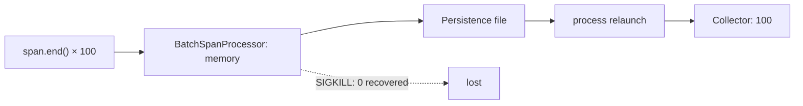

> 検証継続中のドラフトです。結論には必ずexperiment ID、生データ、
> reconciliation結果を対応させています。

## きっかけ

サーバーなら、送信に失敗したテレメトリをプロセスのメモリへしばらく
置いておける。しかしiOSアプリは圏外になり、バックグラウンドへ移り、
ユーザーに終了される。

では、OpenTelemetry SDKで`span.end()`を呼んだ100件のSpanは、実際には
何件バックエンドへ届くのだろうか。

今回の8秒障害では、永続化なしは0件、公式Defaultは100件、公式Instantは
200件届いた。さらに条件を分解すると、100件しか生成していないのに300件
届くrunまで再現した。

一方、100回の`span.end()`が完了した直後にプロセスを止めると、永続化をONに
していても再起動後の回収は0件だった。少し待ってファイルが完成すると100件へ
戻った。

そこで実際のSwiftUI background通知からforceFlushしたところ、45〜52msで
ファイルへ渡り、同じabrupt restartを0件から100件へ変えられた。

ところが同じ対策を500 Spanへ増やすと、forceFlushは完了したのに両presetとも
回収0件になった。1,000 Spanでは先頭768件が消え、末尾232件だけが残った。

欠損を0にすることと、重複を0にすることは別問題だった。

## 先に見つかった意外なもの

独自のディスクキューを作るつもりで調査を始めたが、
`opentelemetry-swift` 2.5.0には既に
`PersistenceSpanExporterDecorator`が存在した。

さらに「永続化あり」は一種類ではない。

- `default` / `lowRuntimeImpact`: 非同期ディスク書き込み。
- `instantDataDelivery`: 同期ディスク書き込み。

同じPersistence Exporterでも、突然の終了に対する生存率と実行コストが
違う可能性がある。そこで、独自実装より先に公式実装を壊して測ることにした。

## 推測ではなくsequence IDを突合する

各Spanへ以下を付与する。

- `lab.experiment.id`
- `lab.run.id`
- `lab.sequence`
- `lab.transport`
- `lab.persistence`
- `lab.ended_at_unix_nano`

アプリ側の`generated.jsonl`とCollector側の`received-otlp.jsonl`を専用CLIで
突合し、欠損・重複・別runの混入を分離する。

## E000：正常系が壊れていないことを確認する

| Persistence | Generated | Received | Duplicate | Missing |
|---|---:|---:|---:|---:|
| なし | 100 | 100 | 0 | 0 |
| Default | 100 | 100 | 0 | 0 |
| Instant | 100 | 100 | 0 | 0 |

正常接続＋明示的flushでは、3条件とも100件が一意に到達した。
これは障害耐性の証明ではなく、以後の比較が壊れた測定器によるものではないと
確認するための対照実験である。

## E001：Collectorを8秒後に起動する

アプリを毎回クリーンインストールし、Collectorが存在しない状態で100 Spanを
生成する。アプリ起動が戻ってから8秒後にCollectorを起動し、その後30秒間、
アプリへ追加操作をしない。

| Persistence | Generated | Unique received | Total received | Duplicate | Missing |
|---|---:|---:|---:|---:|---:|
| なし | 100 | 0 | 0 | 0 | 100 |
| Default | 100 | 100 | 100 | 0 | 0 |
| Instant | 100 | 100 | 200 | 100 | 0 |

永続化なしは、Collector復帰後も自動再送されなかった。Defaultは100件すべてを
一度ずつ回収した。ところがInstantは欠損0と引き換えに、全sequenceを2回ずつ
送った。

偶然を疑い、Instantだけ新しいrun IDとクリーンインストールで追試した。
結果は再び`total received=200`、1〜100がすべて2回だった。

## 最初の推理：forceFlushとworkerが競合した？

アプリは100 Span生成後に`TracerProvider.forceFlush()`を呼んでいた。公式
Persistence Exporterにも定期workerがある。この2経路が同じファイルを読んだ
のではないか、と考えた。

そこでE002では、run metadataへ`flushMode`を追加し、明示的flushだけを無効化
した。他の条件はInstant、8秒障害、100件、30秒窓のままである。

結果は重複0ではなく、さらに増えて300件だった。

| Experiment | Explicit flush | Total received | Exact multiplicity |
|---|---|---:|---:|
| E001 Instant | あり | 200 | 2x |
| E001 Instant追試 | あり | 200 | 2x |
| E002 Instant | なし | 300 | 3x |

明示的flushは必要条件ではなかった。

## ソースを読む：retryの所有者が2つある

固定した`opentelemetry-swift` 2.5.0のソースを追うと、失敗した同じ論理batchを
2層が保持していた。

1. `PersistenceExporterDecorator`は、送信失敗なら永続ファイルを削除しない。
2. `OtlpHttpTraceExporter`も、失敗した送信配列を`pendingSpans`へ戻す。

次の永続化retryで同じ100件が再びHTTP exporterへ渡ると、HTTP側のpending
100件と合流して200件になる。それも失敗すればpendingは200件になり、次の
ファイルretryで300件になり得る。


ただしソースからの推論だけでは足りない。実際のHTTP requestを観測する必要が
ある。

## E003：HTTP bodyが100→200→300へ増えるのを記録する

公式`BaseHTTPClient`を変更せずwrapし、request開始・完了時刻、body bytes、
timeout、成否を`http-attempts.jsonl`へ記録した。Collector停止時間を
4/6/8/10秒へ変え、コードは固定した。

| Collector停止 | 完了した失敗 | 成功body bytes | Total received | Multiplicity |
|---:|---:|---:|---:|---:|
| 4秒 | 0 | 27,818 | 100 | 1x |
| 6秒 | 1 | 55,418 | 200 | 2x |
| 8秒 | 2 | 83,018 | 300 | 3x |
| 10秒 | 2 | 83,018 | 300 | 3x |


8秒runのHTTP lifecycleは次の通りだった。

1. 27,818 bytes：接続拒否で失敗。
2. 55,418 bytes：接続拒否で失敗。
3. 83,018 bytes：成功。

bodyは失敗ごとに27,600 bytesずつ増え、最後のrequestをCollectorが300 Spanと
して受け取った。各sequenceだけでなく、対応するtrace IDとspan IDも3コピーで
同一だった。アプリが300 Spanを新規生成したのではなく、同じ`SpanData`を
再送した証拠になる。

今回の4 runでは、次がすべて成立した。

```text
配送倍率 = 成功までに完了したHTTP失敗回数 + 1
```

10秒runが4倍ではなく3倍なのも重要である。backoffにより、Collector復帰までに
完了した失敗が2回だったためだ。停止秒数ではなく、失敗して二重に保持された
回数が直接の倍率になっていた。

また、失敗は2秒timeoutではなく、数ミリ秒で完了した`NSURLErrorDomain -1004`
の接続拒否だった。「timeout後も古いURLSessionTaskが生き残っただけ」という
別の説明は、この行列には不要だった。

## E004：retryを永続化1層だけにすると100件へ戻った

原因が二重のretry stateなら、HTTP exporterから内部pendingを外せばよい。
そこで、受け取った`SpanData`をOTLP protobuf requestへ変換して送るが、失敗時に
内部保持しないlab用stateless exporterを作った。永続ファイルとretry timingは
引き続き公式Persistence Exporterが担当する。

10秒障害で、stateful/statelessの両方が成功前に2回の接続拒否を完了した。

| Persistence配下のexporter | HTTP body bytes | Total received | Duplicate | Missing |
|---|---|---:|---:|---:|
| 公式stateful | 27,818 → 55,418 → 83,018 | 300 | 200 | 0 |
| lab stateless | 27,818 → 27,818 → 27,818 | 100 | 0 | 0 |

8秒のstateless runも、1回失敗後に同じ27,818-byte bodyを再送し、100件を一度ずつ
回収した。retry stateを永続化1層へ限定することで、欠損0を維持したまま3倍を
1倍へ戻せた。

これは原因に対する介入結果であり、相関だけではない。一方、このlab exporterは
header、compression、metrics、shutdownなど公式実装の全機能を再実装したもの
ではない。設計原則のmechanism proofであって、そのままproduction投入できる
完成品とは主張しない。

## E005：アプリを終了しても100件を回収できるか

E004までは、Collector停止中もアプリのプロセス自体は生きていた。iOSで本当に
気になるのは、ディスクへ保存したあとに元のプロセスが消え、新しいプロセスが
同じSpanを見つけられるかである。

そこでCollectorを止めたまま100 Spanを生成し、ホストから永続ファイルを実際に
観測してSHA-256を記録してから、`simctl terminate`でアプリを終了した。その後に
Collectorを起動し、同じrun IDと永続化ディレクトリを指定してアプリを再起動した。
再起動側はtelemetryを構成するだけで、Spanを1件も新規生成しない。

| Persistence | 終了直前のファイル | 再起動後のHTTP | Total received | Duplicate | Missing |
|---|---:|---|---:|---:|---:|
| Instant | 1（107,770 B） | 27,818 B × 1成功 | 100 | 0 | 0 |
| Default | 1（107,756 B） | 27,818 B × 1成功 | 100 | 0 | 0 |

どちらも最初のプロセスではHTTP送信が始まっていない。再起動後のプロセスが
永続ファイルを読み、1回のrequestで100件を回収した。終了前後の
`generated.jsonl`と`run.json`は、それぞれSHA-256が完全一致した。再起動時に
別の100 Spanを作って帳尻を合わせたのではない。

これで「retryの所有者を永続化1層へ限定する」構成は、送信先の一時障害だけで
なく、完全に保存されたbatchに対する制御されたプロセス終了も越えられた。

ただし、ファイルを観測してから終了した点は意図的な境界条件である。非同期
書き込みの途中、jetsam、クラッシュ、端末再起動まで生存すると一般化はしない。

## E006：`span.end()`済みでも、ファイルになる前なら0件

E005は「完全なファイルを新しいプロセスが読めるか」には答えたが、ファイルが
できる前を避けていた。そこでE006では、アプリ独自の`generated.jsonl`に100件が
揃った瞬間をホストから検知し、追加待機0/50/150/300msでプロセスへ直接
`SIGKILL`を送った。Collectorはプロセス停止後に初めて起動した。

| Persistence | 追加待機 | 台帳観測→SIGKILL要求 | 終了前ファイル | 再起動後received |
|---|---:|---:|---:|---:|
| Default | 0ms | 55ms | 0 | 0/100 |
| Default | 0ms追試 | 14ms | 0 | 0/100 |
| Default | 50ms | 73ms | 0 | 0/100 |
| Default | 150ms | 181ms | 0 | 0/100 |
| Default | 300ms | 331ms | 1 | 100/100 |
| Instant | 0ms | 19ms | 0 | 0/100 |
| Instant | 300ms | 328ms | 1 | 100/100 |


0件runは、再起動後のHTTP attemptも0だった。存在しないファイルからは何も
再送できない。300ms runは終了要求前に完全なファイルが見えており、再起動後の
27,818-byte request 1回で100件を一度ずつ回収した。途中の50件だけ残るような
結果はなく、この条件では100件batch単位で0か100へ分かれた。

固定したソースでは、`BatchSpanProcessor`が終了済みSpanをメモリqueueへ置き、
このアプリの設定では最大0.25秒待ってからexporterへ渡す。Instantの同期書き込み
も、そのPersistence Exporterが呼ばれてから始まる。だからInstantでも、その
上流で止めれば0件になり得る。



なお最初の0ms runは`simctl terminate`を使ったが、停止完了まで約471msかかり、
その間にファイルが完成して100件を回収した。これを0ms成功として採用すると結論を
誤る。runは削除せず校正失敗として保存し、停止手段を直接SIGKILLへ変更してから
行列を再開した。

181msで0、328/331msで100という値は、このSimulatorとホスト観測における境界で
あり、SDKの普遍的なSLAではない。重要なのはミリ秒の数字より、`span.end()`と
「新しいプロセスが回収できる」の間に別の耐久化境界があることだ。

## E007：flush完了を待つと0件から100件へ戻せた

E006で失ったのは、Persistence Exporterへまだ渡っていないbatchだった。それなら
終了前に`TracerProvider.forceFlush()`でBatchSpanProcessorをdrainすればよい。

アプリ側に生成台帳commit、flush開始、flush完了、burst完了のeventを追加し、
単調時計でflush時間も記録した。ホストはflush完了eventを観測してから追加待機0msで
SIGKILLし、同じrunを再起動した。

さらに比較用として、provider forceFlush後にトップレベルのPersistence Exporter
自身もflushする`durabilityBarrier`を実装した。これは非同期file writerを待つが、
Collector停止中でも保存済みファイルの即時送信を試みる。

| Persistence | Flush | App内duration | 終了前file | 終了前HTTP | 再起動後received |
|---|---|---:|---:|---|---:|
| Default | provider only | 37.27ms | 1 | なし | 100/100 |
| Instant | provider only | 74.04ms | 1 | なし | 100/100 |
| Default | durability barrier | 100.11ms | 1 | 1回失敗 | 100/100 |
| Instant | durability barrier | 88.32ms | 1 | 1回失敗 | 100/100 |

同じzero-offset条件でE006はDefault 2/2、Instant 1/1が0/100だった。E007では
provider forceFlushの完了を待つだけで、両方とも100/100へ変わった。0件区間は
避けられない宿命ではなかった。

一方、強いBarrierは回収数を増やさなかった。Barrier runではCollector停止中に
27,818-byte requestが接続拒否で失敗し、再起動後に同じbodyのattempt 2が成功した。
Defaultではprovider onlyより62.84ms、Instantでは14.28ms長く、不要な即時送信も
増えた。この行列での最小介入はprovider forceFlushだった。

ただしDefaultの公式実装は、provider forceFlushから呼ばれた`export`でfile appendを
private queueへ非同期dispatchする。今回たまたまホスト確認までに完了したのであり、
provider forceFlushが全端末で永続化完了を保証する、とソースからは言えない。

ただしE007は実際のbackground通知ではない。synthetic burstの直後にアプリがflushし、
ホストが完了を待ってから殺した。そこで次は、同じ介入をSwiftUIの実lifecycleへ
移した。

## E008：実background通知でも0件から100件へ変わった

E008では`BatchSpanProcessor`のscheduleを5秒へ延ばした。台帳100件を観測した
ホストがMobile Safariを起動し、アプリの`scenePhase`が`.background`になったことを
JSONL eventで確認する。Collectorはまだ起動しない。

- 対照条件はbackground event観測後、そのままSIGKILLする。
- 介入条件はbackground handlerからprovider forceFlushし、完了event観測後に
  SIGKILLする。
- その後Collectorを起動し、同じrun IDでアプリを再起動する。

4条件すべてでbackground eventは台帳commit後1.74〜2.56秒に発生し、5秒schedule
より前だった。

| Persistence | background時の動作 | Flush duration | 終了前file | 再起動後received |
|---|---|---:|---:|---:|
| Default | 何もしない | — | 0 | 0/100 |
| Instant | 何もしない | — | 0 | 0/100 |
| Default | provider forceFlush | 45.32ms | 1 | 100/100 |
| Instant | provider forceFlush | 51.39ms | 1 | 100/100 |


flushなしでは、DefaultもInstantも永続化ファイル0、HTTP attempt 0、回収0だった。
Instantの同期writerであっても、上流batchから呼ばれなければ何も保存できない。

介入条件ではbackground、flush開始、flush完了が順番に記録され、停止前に完全な
ファイルが1個見えた。再起動後はどちらも27,818-byte requestを1回だけ送り、
100/100、重複0で一致した。

これは実際のiOS lifecycle callback内で介入が実行できた証拠だが、実端末の
suspension deadlineやjetsamまで保証するものではない。100 Span・Simulator・
各1 runのmechanism proofとして扱う。

## E009：flush完了なのに、500件では0件になった

E008の成功が100 Span専用の偶然でないかを確認するため、実background flushを
100、500、1,000 Spanへ増やした。最初のrunではSimulatorのbackground通知が
5秒scheduleより遅れたため、証跡を残して除外した。以後はscheduleを15秒へ広げ、
アプリ内timestampでbackgroundがその前に来たことをrunnerが検査する。

結果は単純な性能劣化ではなかった。

| Persistence | Planned | Flush duration | 終了前file | 再起動後received |
|---|---:|---:|---:|---:|
| Default | 100 | 111.96ms | 107,791 bytes | 100/100 |
| Default | 500 | 167.32ms | 0 | 0/500 |
| Default | 1,000 | 289.89ms | 250,297 bytes | 232/1,000 |
| Instant | 100 | 208.35ms | 107,785 bytes | 100/100 |
| Instant | 500 | 196.76ms | 0 | 0/500 |
| Instant | 1,000 | 220.38ms | 250,307 bytes | 232/1,000 |


全条件でprovider forceFlushは1秒以内に完了扱いになった。最初のプロセスのHTTP
attemptは0で、DefaultとInstantの結果も完全に一致した。非同期writerの速さでは
説明できない。

固定したソースを追うと、別単位の上限が衝突していた。

1. labの`BatchSpanProcessor.maxExportBatchSize`は256 Span。
2. processorは1,000件を`256 + 256 + 256 + 232`に分割する。
3. Persistence Exporterは各chunk全体を1個のJSON objectへencodeする。
4. 両presetの`maxObjectSize`は256 KiB。
5. objectが上限を超えるとwriter内部で例外になるが、空の`catch {}`で消える。
6. 外側のPersistence exporterは`.success`を返し、processorはchunkを戻さない。

これでsequenceまで説明できる。1,000件runで消えたのは1〜768、残ったのは
769〜1,000だった。256件chunk 3個はbyte上限を超え、最後の232件だけが約250KBの
fileへ入った。500件は`256 + 244`の両objectが上限を超え、file自体が0だった。

危険なのは、失敗が遅いことではなく成功に見えることだ。flush durationを測るだけ
では、このsilent lossを発見できなかった。安全なSpan件数も普遍的ではない。
attributeが長くなれば、同じ256件でもencoded byteは増える。

## 何が「不可能を可能」にしたのか

8秒障害で永続化なしの回収率は0%だった。公式Defaultは同じ条件で100%を一意に
回収した。つまり、アプリが生きている間の一時的な送信先障害は、設定だけで
0%から100%へ変えられた。

さらに、完全な永続ファイルを確認後にプロセスを終了しても、DefaultとInstantの
両方が新しいプロセスから100件を一意に回収できた。少なくともこの制御条件では、
「元のプロセスが死んだら終わり」でもなかった。

ただしE006により、終了済みSpanが自動的に耐久化済みになるわけではないことも
分かった。新しいプロセスが回収できたのは、完全なファイルへ到達したbatchだけ
だった。

E007では、その境界をforceFlushで能動的に越えさせ、同じabrupt stopを0件から
100件へ変えられた。ただ永続化をONにするのではなく、いつdurableになったと
みなすかをアプリ側で制御した結果である。

E008ではその制御を実際の`scenePhase.background`へ移しても、両presetで0/100から
100/100へ変わった。「backgroundへ行くから失う」を完全に不可避とせず、利用可能な
lifecycle windowで耐久境界を越える、という介入にできた。

ただしE009で、その介入はbatch objectが内部byte上限へ収まる場合に限られると
分かった。次の「可能にする」は、count-based chunkを安全側へ小さくし、500/1,000
件の0/232を100%へ戻せるかである。

一方、InstantとstatefulなOTLP/HTTP exporterを重ねると、早いretryが欠損を
回収しながらコピーを増幅した。at-least-onceを2層へ独立に持たせると、各層が
正しくretryしても、組み合わせ全体が望むsemanticsになるとは限らない。

## 実運用で考えられる対策

E004とE005により「retryの所有者を1層にする」方針は、一時障害と制御された
プロセス再起動の両方で欠損0・重複0を両立した。ただしproduction向けの実装方式
と、他の対策とのコスト比較は未検証である。

- retryの所有者を1層にする（mechanism proof済み）。
- 永続化側がretryするなら、失敗batchを内部保持しないstateless exporterを使う。
- `scenePhase.background`でbatch queueをflushする（Simulatorでmechanism proof済み）。
- `maxExportBatchSize`をencoded objectのbyte上限から安全側へ決める。
- oversizeを握りつぶさず、metric・log・export failureとして可視化する。
- batch delay短縮やSimpleSpanProcessorを、書き込みコストと比較する。
- Collectorや保存先でtrace ID/span IDをキーにdeduplicateする。

下流dedupは可能そうだが、保持期間・状態量・コストをreceiver側へ移す。
次は小さいexport chunkで同じ500/1,000件を回収できるかを先に検証し、その後に
background flush時間とUI応答性のトレードオフを測る必要がある。

## 試行錯誤も証跡に残す

E001では2回の無効試行があった。1回目は手作業で8秒を超過し、2回目はアプリが
experiment IDを`E000`へhard-codeしていた。どちらも削除せず、なぜ結論へ
採用しなかったかをmanifestへ残した。

また、HTTP計測ファイル追加後の最初のbuildは、XcodeGen再生成漏れで失敗した。
これもlab notebookへ残している。成功runだけ並べると、測定器をどう疑い、
どの仮説を捨てたかが見えなくなるからだ。

## 制約

- iPhone 17 Simulator / iOS 26.4.1。
- `opentelemetry-swift` 2.5.0、core 2.5.1。
- `otelcol` 0.157.0。
- loopbackの接続拒否、OTLP/HTTP protobuf、100〜1,000 Span。
- 各停止時間は1 run。ただし8秒3倍は非計測E002でも独立再現した。
- 再起動試験は`simctl terminate`による制御された終了であり、ファイル観測後に
  実行した。
- 書き込み境界試験はSimulatorプロセスへの直接SIGKILLであり、実端末のjetsamや
  ユーザー終了と同一ではない。
- E007のflush介入はsynthetic、E008は実際のSwiftUI lifecycle callbackだが、
  Simulatorがbackground実行を許した単一条件である。

SDK全バージョン、実端末、すべてのネットワーク障害へ一般化はしない。

## 次に壊すもの

- stateless exporterに公式実装相当のheader・compression・shutdownを足せるか。
- `maxExportBatchSize=100`で500/1,000 Spanを全件回収できるか。
- lifecycle flush中のmain-thread応答性とenergy costは何か。
- 実端末でbackground flushがsuspension前に完了するか。途中で止めると何件残るか。
- jetsam・クラッシュ・端末再起動・アプリ更新でも回収できるか。
- 1,000 Span時の書き込み時間、ストレージ、メインスレッド影響。
- downstream dedupに必要な状態量。

## 結論

OpenTelemetry Swiftの公式Persistence Exporterは、8秒の送信先障害に対して
0件だったSpanを100件回収できた。しかしInstant presetと今回のOTLP/HTTP
exporterの組み合わせでは、失敗ごとに同じbatchを2層が保持し、成功requestが
100→200→300 Spanへ増幅した。HTTP側をstatelessにしてretryの所有者を
永続化1層へ絞ると、同じ2回失敗でも成功requestは100 Spanのままになった。
完全な永続ファイルを確認してプロセスを終了したE005でも、DefaultとInstantは
再起動後に100件を一度ずつ回収した。

しかしE006では、100回の`span.end()`と独自台帳の記録が終わっていても、
Persistence fileがまだなければ再起動後は0件だった。300ms条件でファイルが
見えてからは再び100件を回収した。耐久境界は設定フラグでもAPI callでもなく、
次のプロセスが読める状態へbatchが到達したかどうかにある。

E007ではprovider forceFlush完了を待ってから同じSIGKILLを送り、両presetを
100/100へ戻した。より強いexporter Barrierも100/100だったが、失敗送信と追加
blockを増やしただけだった。最小の介入で耐久境界を越える方が、この条件では
良い結果になった。

E008ではその最小介入を実際の`scenePhase.background`から呼んだ。flushなしは
両presetとも0/100、flushありは45〜52msでfileへ到達し100/100だった。永続化の
種類より前に、上流batchをいつ永続化層へ渡すかが生存率を決めた。

しかしE009で500/1,000 Spanへ増やすと、別の境界が現れた。Span数で256件ずつ
切ったencoded objectが256 KiBを超え、writerはerrorを外へ返さなかった。
forceFlush完了後でも500件は0、1,000件は末尾232件だけになった。APIの成功と
データの耐久化は、この条件では同じ意味ではなかった。

「永続化をONにしたから安心」ではなく、誰がretryを所有し、失敗した同じ
telemetryを各層が何コピー保持するか、そしていつメモリから耐久ストレージへ
渡るか、1 objectが内部byte上限へ収まるかまで測る必要がある。
